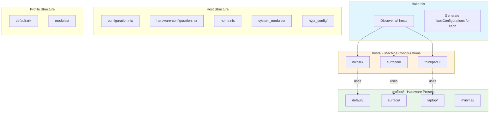

# NixOS Config Refactoring Plan: Hosts vs Profiles Architecture

## Executive Summary

This document outlines a refactoring plan to clarify the distinction between **hosts** (individual machine configurations) and **profiles** (reusable preset configurations for hardware types).

### Key Changes

1. **Profiles as presets** - Reusable configuration modules for hardware types (surface, laptop, minimal)
2. **Hosts as machines** - Individual machine configurations that may use profile presets
3. **Multi-host support** - Flake exposes ALL hosts simultaneously in `nixosConfigurations`

---

## Current vs Desired Architecture

### Current (Incorrect) Implementation

```
selected-profile.nix     → selects ONE profile at a time
profiles/                → contains HOST configs (nixos0, surface0, thinkpad0)
                         → semantic confusion: profiles are actually hosts
flake.nix               → exposes only ONE host based on selected-profile.nix
```

**Problems:**
- Profiles are misnamed - they contain host-specific configurations
- Only one host can be built at a time
- No reusable preset system for hardware types

### Desired Architecture

```
hosts/                    # Multi-host configurations
├── nixos0/              # Desktop host
├── surface0/            # Surface tablet (uses "surface" profile preset)
└── thinkpad0/           # ThinkPad laptop (uses "laptop" profile preset)

profiles/                 # Preset configurations (reusable)
├── default/             # Default preset (base configuration)
├── surface/             # Surface-specific preset (thermal, hardware quirks)
├── laptop/              # Laptop preset (power management, proxy)
└── minimal/             # Minimal preset (limited hardware)

flake.nix → exposes ALL hosts in nixosConfigurations
```

---

## Architecture Diagram



---

## Target Directory Structure

```
nixos-config/
├── flake.nix                          # Multi-host flake (exposes ALL hosts)
├── flake_modules/                     # Flake helper modules
│   ├── hosts.nix                      # Host discovery and generation
│   ├── modules.nix                    # Module utilities
│   └── overlays.nix                   # Overlay definitions
│
├── base_configuration/                # Shared base modules
│   ├── configuration.nix              # Base system entry
│   └── system/                        # System-level shared modules
│       ├── fish_functions/
│       └── helpers/
│
├── configuration/                     # Legacy shared configuration
│   ├── system/                        # Shared system modules
│   │   ├── configuration.nix
│   │   ├── system-extended.nix
│   │   └── system_modules/
│   └── home/                          # Shared home modules
│       ├── home.nix
│       ├── home_modules/
│       └── hypr_config/
│
├── hosts/                             # Host-specific configurations
│   ├── nixos0/
│   │   ├── user-config.nix            # Host-specific user config
│   │   ├── hardware-configuration.nix # Hardware config (generated)
│   │   ├── configuration.nix          # Main system entry
│   │   ├── home.nix                   # Home-manager entry
│   │   ├── system_modules/            # Host-specific system modules
│   │   └── hypr_config/               # Host-specific Hyprland config
│   │       └── monitors.conf
│   ├── surface0/
│   │   ├── user-config.nix
│   │   ├── hardware-configuration.nix
│   │   ├── configuration.nix
│   │   ├── home.nix
│   │   ├── system_modules/
│   │   │   ├── boot.nix
│   │   │   ├── hardware.nix
│   │   │   ├── clear-bdprochot.nix
│   │   │   └── thermal-config.nix
│   │   └── hypr_config/
│   │       └── monitors.conf
│   └── thinkpad0/
│       ├── user-config.nix
│       ├── hardware-configuration.nix
│       ├── configuration.nix
│       ├── home.nix
│       ├── system_modules/
│       │   ├── hardware.nix
│       │   └── zram.nix
│       └── hypr_config/
│           └── monitors.conf
│
└── profiles/                          # Hardware preset configurations
    ├── default/                       # Default preset (base for all)
    │   ├── default.nix                # Preset entry point
    │   └── modules/                   # Preset-specific modules
    ├── surface/                       # Surface tablet preset
    │   ├── default.nix
    │   └── modules/
    │       ├── thermal.nix            # Thermal management
    │       └── hardware-quirks.nix    # Surface hardware quirks
    ├── laptop/                        # Laptop preset
    │   ├── default.nix
    │   └── modules/
    │       ├── power-management.nix   # Power management
    │       └── proxy.nix              # Proxy configuration
    └── minimal/                       # Minimal preset
        ├── default.nix
        └── modules/
```

---

## Profile Presets Design

### Purpose of Profiles

Profiles are **reusable configuration presets** for specific hardware types or use cases. They provide:

1. **Default settings** for a hardware category
2. **Common modules** that all machines of that type need
3. **Sensible defaults** that can be overridden per-host

### Profile Definitions

#### default Profile

The base preset that all hosts implicitly use. Contains:

- Core system configuration
- Common packages
- Standard services

```nix
# profiles/default/default.nix
{ ... }:
{
  imports = [
    # Base configuration
    ../../base_configuration/configuration.nix
    ../../configuration/system/system-extended.nix
  ];

  # Default settings that can be overridden
  proxy.enable = false;
}
```

#### surface Profile

Surface tablet preset with thermal and hardware quirks:

```nix
# profiles/surface/default.nix
{ ... }:
{
  imports = [
    ../default/default.nix
    ./modules/thermal.nix
    ./modules/hardware-quirks.nix
  ];

  # Surface-specific defaults
  powerManagement.enable = true;
}
```

#### laptop Profile

Laptop preset with power management and proxy:

```nix
# profiles/laptop/default.nix
{ ... }:
{
  imports = [
    ../default/default.nix
    ./modules/power-management.nix
    ./modules/proxy.nix
  ];

  # Laptop-specific defaults
  proxy.enable = true;
  services.autoLogin.enable = false;
}
```

#### minimal Profile

Minimal preset for limited hardware:

```nix
# profiles/minimal/default.nix
{ ... }:
{
  imports = [
    ../default/default.nix
  ];

  # Minimal configuration
  services = {
    # Disable non-essential services
  };
}
```

---

## Host Configuration Design

### Host Structure

Each host is a self-contained machine configuration:

```
hosts/<hostname>/
├── user-config.nix            # User and host metadata
├── hardware-configuration.nix # Hardware-specific config (generated)
├── configuration.nix          # Main system configuration
├── home.nix                   # Home-manager configuration
├── system_modules/            # Host-specific system modules
└── hypr_config/               # Host-specific Hyprland config
```

### Host-to-Profile Mapping

Each host specifies which profile preset to use:

```nix
# hosts/nixos0/configuration.nix
{ inputs, profile ? null, ... }:
let
  # Use default profile if no profile specified
  profileConfig = if profile != null
    then import profile
    else import ../../profiles/default;
in
{
  imports = [
    # Hardware configuration
    ./hardware-configuration.nix

    # Profile preset
    profileConfig

    # Host-specific modules
    ./system_modules

    # External modules
    inputs.jovian.nixosModules.default
  ];

  networking.hostName = "popcat19-nixos0";

  # Host-specific overrides
  proxy.enable = false;
}
```

### Host Metadata (user-config.nix)

```nix
# hosts/nixos0/user-config.nix
{
  system = "x86_64-linux";
  hostname = "popcat19-nixos0";
  username = "popcat19";
  profile = "default";  # Which profile preset to use
}
```

---

## Flake Design: Multi-Host Support

### Key Changes

1. **Remove `selected-profile.nix`** - No longer needed
2. **Auto-discover hosts** - Scan `hosts/` directory
3. **Generate all configurations** - Create `nixosConfigurations` for each host

### New flake.nix

```nix
# flake.nix
{
  description = "NixOS configuration with multi-host support";

  inputs = {
    # ... (existing inputs)
  };

  outputs = inputs@{ nixpkgs, ... }:
  let
    # Import helper modules
    overlays = import ./configuration/flake/modules/overlays.nix;

    # Supported systems
    supportedSystems = [ "x86_64-linux" ];

    # Discover all hosts automatically
    hostDirs = builtins.readDir ./hosts;
    hostNames = builtins.attrNames hostDirs;

    # Create a configuration for each host
    mkHostConfig = hostname:
      let
        hostPath = ./hosts/${hostname};
        userConfig = import "${hostPath}/user-config.nix";
        profilePath = ./profiles/${userConfig.profile or "default"};
      in
      {
        name = userConfig.hostname;
        value = nixpkgs.lib.nixosSystem {
          system = userConfig.system;

          specialArgs = {
            inherit inputs userConfig;
            profile = profilePath;
          };

          modules = [
            # Host's main configuration
            "${hostPath}/configuration.nix"

            # Home Manager
            inputs.home-manager.nixosModules.home-manager
            {
              home-manager = {
                useGlobalPkgs = false;
                useUserPackages = true;
                sharedModules = [
                  {
                    nixpkgs.config.allowUnfree = true;
                    nixpkgs.overlays = (overlays userConfig.system) ++ [ inputs.nur.overlays.default ];
                  }
                ];
                users.${userConfig.username} = import "${hostPath}/home.nix";
                extraSpecialArgs = {
                  hostPlatform = userConfig.system;
                  inherit inputs userConfig;
                };
              };
            }
          ];
        };
      };

  in
  {
    # Packages output
    packages = nixpkgs.lib.genAttrs supportedSystems (system: {
      agenix = inputs.agenix.packages.${system}.default;
    });

    # Formatter
    formatter = nixpkgs.lib.genAttrs supportedSystems (
      system: nixpkgs.legacyPackages.${system}.nixfmt-tree
    );

    # Multi-host NixOS configurations
    nixosConfigurations = builtins.listToAttrs (
      map mkHostConfig hostNames
    );
  };
}
```

### Result: All Hosts Available

```bash
# Build any host
nixos-rebuild build --flake .#popcat19-nixos0
nixos-rebuild build --flake .#popcat19-surface0
nixos-rebuild build --flake .#popcat19-thinkpad0

# All hosts are available simultaneously
nix flake show
# => nixosConfigurations
# =>   popcat19-nixos0
# =>   popcat19-surface0
# =>   popcat19-thinkpad0
```

---

## Migration Plan

### Phase 1: Create Profile Presets

1. Create `profiles/default/` with base configuration
2. Create `profiles/surface/` with Surface-specific modules
3. Create `profiles/laptop/` with laptop-specific modules
4. Create `profiles/minimal/` for minimal configurations

### Phase 2: Restructure Hosts

1. Keep existing `hosts/` structure (already correct)
2. Add `profile = "..."` to each host's `user-config.nix`
3. Update host `configuration.nix` to import profile preset

### Phase 3: Update Flake

1. Remove `selected-profile.nix`
2. Implement auto-discovery of hosts
3. Generate all `nixosConfigurations` simultaneously

### Phase 4: Clean Up

1. Remove old `profiles/` directory (currently contains hosts)
2. Update documentation
3. Test all hosts build correctly

---

## Host-to-Profile Mapping Summary

| Host | Profile | Reason |
|------|---------|--------|
| nixos0 | default | Desktop, no special hardware |
| surface0 | surface | Surface tablet with thermal quirks |
| thinkpad0 | laptop | Laptop with power management |

---

## Benefits of New Architecture

1. **Clear Separation**: Hosts are machines, profiles are presets
2. **Reusability**: Profiles can be used by multiple hosts
3. **Multi-Host**: All hosts available simultaneously
4. **Flexibility**: Hosts can override profile defaults
5. **Discoverability**: Auto-discovery of hosts from directory

---

## File Migration Summary

### Files to Create

| Path | Purpose |
|------|---------|
| `profiles/default/default.nix` | Base profile preset |
| `profiles/surface/default.nix` | Surface profile preset |
| `profiles/surface/modules/*.nix` | Surface-specific modules |
| `profiles/laptop/default.nix` | Laptop profile preset |
| `profiles/laptop/modules/*.nix` | Laptop-specific modules |
| `profiles/minimal/default.nix` | Minimal profile preset |

### Files to Modify

| Path | Changes |
|------|---------|
| `flake.nix` | Multi-host support, auto-discovery |
| `hosts/*/user-config.nix` | Add `profile` field |
| `hosts/*/configuration.nix` | Import profile preset |

### Files to Remove

| Path | Reason |
|------|--------|
| `selected-profile.nix` | No longer needed |
| `profiles/nixos0/` | Move to hosts/ |
| `profiles/surface0/` | Move to hosts/ |
| `profiles/thinkpad0/` | Move to hosts/ |

---

## Testing Plan

### Per-Host Validation

| Host | Build Command | Expected Profile |
|------|---------------|------------------|
| nixos0 | `nixos-rebuild build --flake .#popcat19-nixos0` | default |
| surface0 | `nixos-rebuild build --flake .#popcat19-surface0` | surface |
| thinkpad0 | `nixos-rebuild build --flake .#popcat19-thinkpad0` | laptop |

### Validation Checklist

- [ ] All hosts appear in `nix flake show`
- [ ] Each host builds successfully
- [ ] Profile presets are correctly applied
- [ ] Host-specific overrides work
- [ ] Home-manager configurations apply correctly
- [ ] Hardware-specific modules load correctly

---

## Summary

This refactoring clarifies the architecture by:

1. **Profiles as presets** - Reusable configuration modules for hardware types
2. **Hosts as machines** - Individual machine configurations
3. **Multi-host support** - All hosts exposed simultaneously
4. **Clear mapping** - Each host specifies which profile to use

The result is a more maintainable, flexible, and semantically correct configuration structure.
