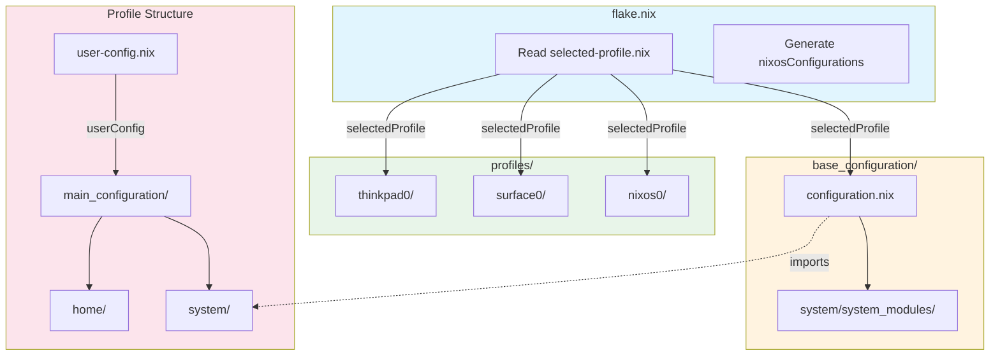
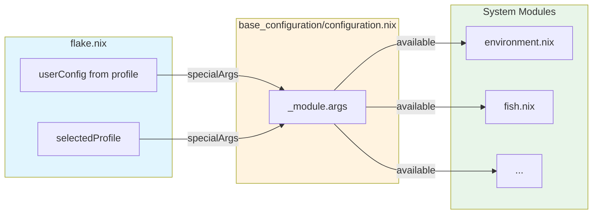

# NixOS Config Refactoring Plan: shimboot_config Pattern Adoption

## Executive Summary

This document outlines a detailed plan to refactor the nixos-config repository to follow the shimboot_config pattern while preserving all existing host functionality (nixos0, surface0, thinkpad0).

## Table of Contents

1. [Current Structure Analysis](#current-structure-analysis)
2. [Target Structure Design](#target-structure-design)
3. [Directory Mapping](#directory-mapping)
4. [File Migration Plan](#file-migration-plan)
5. [Entry Point Changes](#entry-point-changes)
6. [Module Argument Injection](#module-argument-injection)
7. [Host-to-Profile Mapping](#host-to-profile-mapping)
8. [Migration Strategy](#migration-strategy)
9. [Testing Plan](#testing-plan)

---

## Current Structure Analysis

### Directory Overview

```
nixos-config/
├── flake.nix                          # Flake entry, generates nixosConfigurations
├── configuration/
│   ├── user-config.nix                # Global user config (hosts list, settings)
│   ├── flake/modules/                 # Flake modules (hosts.nix, modules.nix)
│   ├── system/                        # Shared system modules
│   │   ├── configuration.nix          # Base system entry
│   │   ├── system-extended.nix        # Extended system entry
│   │   └── system_modules/            # Individual modules
│   └── home/                          # Shared home modules
│       ├── home.nix                   # Main home entry
│       ├── home_modules/              # Individual modules
│       ├── hypr_config/               # Hyprland config
│       └── (other configs)
└── hosts/                             # Host-specific configs
    ├── nixos0/
    ├── surface0/
    └── thinkpad0/
```

### Key Patterns Identified

1. **Host Generation**: [`flake.nix`](flake.nix:112) uses [`hosts.mkHostConfig`](configuration/flake/modules/hosts.nix:3) to generate configurations
2. **User Config Pattern**: [`user-config.nix`](configuration/user-config.nix:1) accepts parameters (hostname, system, username, machine)
3. **Module Injection**: [`configuration.nix`](configuration/system/configuration.nix:39) uses `_module.args.userConfig` to inject userConfig
4. **Two-Tier Imports**: Host configs import shared system/home configs
5. **Host-Specific Overrides**: Each host has its own `system_modules/` and `hypr_config/`

---

## Target Structure Design

### New Directory Structure

```
nixos-config/
├── flake.nix                          # Updated flake entry
├── selected-profile.nix               # Profile selector (NEW)
├── base_configuration/                # Shared base modules (RENAMED from configuration/system)
│   ├── configuration.nix              # Base system entry (injects userConfig, selectedProfile)
│   └── system/                        # System-level modules
│       └── system_modules/            # Individual modules
└── profiles/                          # Profile-based configs (RENAMED from hosts)
    ├── nixos0/
    │   ├── user-config.nix            # Profile-specific user config (NEW)
    │   ├── hardware-configuration.nix # Hardware config (MOVED)
    │   └── main_configuration/        # Profile main config (NEW structure)
    │       ├── configuration.nix      # Profile system entry
    │       ├── system/                # Profile-specific system modules
    │       │   └── system_modules/
    │       └── home/                  # Home-Manager modules
    │           ├── home.nix
    │           ├── hypr_config/
    │           └── (other configs)
    ├── surface0/
    │   └── (same structure)
    └── thinkpad0/
        └── (same structure)
```

### Architecture Diagram



---

## Directory Mapping

### Complete Mapping Table

| Current Path | New Path | Notes |
|-------------|----------|-------|
| `configuration/system/` | `base_configuration/` | Renamed directory |
| `configuration/system/configuration.nix` | `base_configuration/configuration.nix` | Updated to inject selectedProfile |
| `configuration/system/system_modules/` | `base_configuration/system/system_modules/` | Moved under system/ subdirectory |
| `configuration/system/system-extended.nix` | `base_configuration/system-extended.nix` | Moved |
| `configuration/user-config.nix` | `profiles/<profile>/user-config.nix` | Per-profile config |
| `configuration/home/` | `profiles/<profile>/main_configuration/home/` | Per-profile home config |
| `hosts/<host>/` | `profiles/<host>/` | Renamed directory |
| `hosts/<host>/configuration.nix` | `profiles/<host>/main_configuration/configuration.nix` | Moved |
| `hosts/<host>/home.nix` | `profiles/<host>/main_configuration/home/home.nix` | Moved |
| `hosts/<host>/hardware-configuration.nix` | `profiles/<host>/hardware-configuration.nix` | Kept at profile root |
| `hosts/<host>/system_modules/` | `profiles/<host>/main_configuration/system/system_modules/` | Moved |
| `hosts/<host>/hypr_config/` | `profiles/<profile>/main_configuration/home/hypr_config/` | Moved to home |
| `configuration/flake/modules/` | `flake_modules/` | Moved to root for clarity |

---

## File Migration Plan

### Phase 1: Create New Directory Structure

```bash
# Create new directories
mkdir -p base_configuration/system/system_modules
mkdir -p profiles/nixos0/main_configuration/{system/system_modules,home}
mkdir -p profiles/surface0/main_configuration/{system/system_modules,home}
mkdir -p profiles/thinkpad0/main_configuration/{system/system_modules,home}
mkdir -p flake_modules
```

### Phase 2: Move Base Configuration Files

| File | Action | New Location |
|------|--------|--------------|
| `configuration/system/configuration.nix` | Move + Modify | `base_configuration/configuration.nix` |
| `configuration/system/system-extended.nix` | Move | `base_configuration/system-extended.nix` |
| `configuration/system/system_modules/*.nix` | Move | `base_configuration/system/system_modules/` |

### Phase 3: Create Profile-Specific Files

#### Per-Profile user-config.nix

Each profile gets its own `user-config.nix` derived from the global one:

```nix
# profiles/nixos0/user-config.nix
{
  system ? "x86_64-linux",
  username ? "popcat19",
}:
import ../../base_configuration/user-config-defaults.nix {
  inherit system username;
  machine = "nixos0";
}
```

### Phase 4: Move Host Files to Profiles

| Current | New |
|---------|-----|
| `hosts/nixos0/configuration.nix` | `profiles/nixos0/main_configuration/configuration.nix` |
| `hosts/nixos0/home.nix` | `profiles/nixos0/main_configuration/home/home.nix` |
| `hosts/nixos0/hardware-configuration.nix` | `profiles/nixos0/hardware-configuration.nix` |
| `hosts/nixos0/system_modules/*` | `profiles/nixos0/main_configuration/system/system_modules/` |
| `hosts/nixos0/hypr_config/` | `profiles/nixos0/main_configuration/home/hypr_config/` |

### Phase 5: Move Shared Home Configuration

The shared home configuration from `configuration/home/` needs to be split:

1. **Base home modules** → `base_configuration/home/home_modules/` (truly shared)
2. **Profile-specific** → `profiles/<profile>/main_configuration/home/` (per-profile)

---

## Entry Point Changes

### flake.nix Changes

```nix
# Before (current)
{
  outputs = inputs@{ nixpkgs, ... }:
  let
    modules = import ./configuration/flake/modules/modules.nix;
    hosts = import ./configuration/flake/modules/hosts.nix;
    baseUserConfig = import ./configuration/user-config.nix { };
  in {
    nixosConfigurations =
      let inherit (baseUserConfig.hosts) machines;
      in nixpkgs.lib.listToAttrs (
        map (m: let
          perHostConfig = import ./configuration/user-config.nix {
            inherit (baseUserConfig.user) username;
            machine = m;
            system = "x86_64-linux";
          };
          inherit (perHostConfig.host) hostname;
        in {
          name = hostname;
          value = hosts.mkHostConfig hostname "x86_64-linux"
            ./hosts/${m}/configuration.nix
            ./hosts/${m}/home.nix
            { inherit inputs nixpkgs modules; userConfig = perHostConfig; };
        }) machines
      );
  };
}

# After (new pattern)
{
  outputs = inputs@{ nixpkgs, ... }:
  let
    modules = import ./flake_modules/modules.nix;
    profileConfig = import ./selected-profile.nix;
    selectedProfile = profileConfig.profile;
  in {
    nixosConfigurations =
      let
        profilePath = ./profiles/${selectedProfile};
        userConfig = import ${profilePath}/user-config.nix { };
        inherit (userConfig.host) hostname;
      in {
        "${hostname}" = mkHostConfig {
          inherit inputs nixpkgs modules userConfig selectedProfile;
          system = "x86_64-linux";
          profilePath = profilePath;
        };
      };
  };
}
```

### selected-profile.nix (NEW)

```nix
# selected-profile.nix
# Profile selector - change this to switch between profiles
{
  profile = "nixos0";  # Options: nixos0, surface0, thinkpad0
}
```

### base_configuration/configuration.nix Changes

```nix
# base_configuration/configuration.nix
{ inputs, userConfig, selectedProfile, ... }:
{
  imports = [
    ./system/system_modules/environment.nix
    ./system/system_modules/fish.nix
    # ... other modules
  ];

  # Inject userConfig for all imported modules
  _module.args.userConfig = userConfig;
  _module.args.selectedProfile = selectedProfile;

  # ... rest of configuration
}
```

### Profile configuration.nix Changes

```nix
# profiles/nixos0/main_configuration/configuration.nix
{ inputs, userConfig, selectedProfile, ... }:
{
  imports = [
    # Hardware configuration at profile root
    ../hardware-configuration.nix

    # Base configuration (shared)
    ../../../base_configuration/configuration.nix
    ../../../base_configuration/system-extended.nix

    # Profile-specific system modules
    ./system/system_modules/default.nix  # If any exist

    # External modules
    inputs.jovian.nixosModules.default
  ];

  networking.hostName = userConfig.host.hostname;

  # Profile-specific settings
  proxy.enable = false;
}
```

---

## Module Argument Injection

### Current Pattern

```nix
# configuration/system/configuration.nix
let
  userConfig = import ../../configuration/user-config.nix { };
in
{
  _module.args.userConfig = userConfig;
  # ...
}
```

### New Pattern

```nix
# base_configuration/configuration.nix
{ inputs, userConfig, selectedProfile, ... }:
{
  _module.args = {
    inherit userConfig selectedProfile;
  };
  # ...
}
```

### Injection Flow Diagram



### Home Manager Integration

```nix
# In flake.nix home-manager config
{
  home-manager = {
    useGlobalPkgs = false;
    useUserPackages = true;
    users.${userConfig.user.username} = import ${profilePath}/main_configuration/home/home.nix;
    extraSpecialArgs = {
      hostPlatform = system;
      inherit userConfig inputs selectedProfile;
    };
  };
}
```

---

## Host-to-Profile Mapping

### Profile Structure for Each Host

#### nixos0 Profile

```
profiles/nixos0/
├── user-config.nix                    # Machine: nixos0
├── hardware-configuration.nix         # From hosts/nixos0/
└── main_configuration/
    ├── configuration.nix              # System entry
    ├── system/
    │   └── (empty - uses base modules)
    └── home/
        ├── home.nix                   # Home entry
        └── hypr_config/
            └── monitors.conf          # Monitor config
```

#### surface0 Profile

```
profiles/surface0/
├── user-config.nix                    # Machine: surface0
├── hardware-configuration.nix         # From hosts/surface0/
└── main_configuration/
    ├── configuration.nix              # System entry
    ├── system/
    │   └── system_modules/
    │       ├── boot.nix               # Surface-specific boot
    │       ├── hardware.nix           # Surface hardware
    │       ├── clear-bdprochot.nix    # Thermal fix
    │       └── thermal-config.nix     # Thermal config
    └── home/
        ├── home.nix
        └── hypr_config/
            └── monitors.conf
```

#### thinkpad0 Profile

```
profiles/thinkpad0/
├── user-config.nix                    # Machine: thinkpad0
├── hardware-configuration.nix         # From hosts/thinkpad0/
└── main_configuration/
    ├── configuration.nix              # System entry
    ├── system/
    │   └── system_modules/
    │       ├── hardware.nix           # ThinkPad hardware
    │       └── zram.nix               # ZRAM config
    └── home/
        ├── home.nix
        └── hypr_config/
            └── monitors.conf
```

### Profile Selection Logic

```nix
# selected-profile.nix
{
  # Change this value to switch profiles
  profile = "nixos0";
}

# flake.nix
let
  profileConfig = import ./selected-profile.nix;
  selectedProfile = profileConfig.profile;

  # Validate profile exists
  validProfiles = [ "nixos0" "surface0" "thinkpad0" ];
  isValidProfile = builtins.elem selectedProfile validProfiles;

  # Error if invalid
  profilePath = if isValidProfile
    then ./profiles/${selectedProfile}
    else builtins.throw "Invalid profile: ${selectedProfile}";
in
# ...
```

---

## Migration Strategy

### Approach: Parallel Structure Migration

This approach maintains the old structure while building the new one, allowing for incremental testing.

### Migration Steps

#### Step 1: Create New Structure (Non-Breaking)

1. Create `base_configuration/` directory
2. Create `profiles/` directory structure
3. Create `selected-profile.nix`
4. Create `flake_modules/` and move flake modules

#### Step 2: Copy and Adapt Base Configuration

1. Copy `configuration/system/` to `base_configuration/`
2. Update imports in `base_configuration/configuration.nix`
3. Add `selectedProfile` parameter and injection

#### Step 3: Create Profile Configurations

For each profile (nixos0, surface0, thinkpad0):

1. Create profile directory structure
2. Create `user-config.nix` for profile
3. Copy `hardware-configuration.nix`
4. Create `main_configuration/configuration.nix`
5. Create `main_configuration/home/home.nix`
6. Copy host-specific `system_modules/`
7. Copy `hypr_config/` to home

#### Step 4: Update Flake

1. Create new `flake.nix` with profile-based logic
2. Keep old `nixosConfigurations` as fallback initially
3. Test new configuration generation

#### Step 5: Test and Validate

1. Build each profile: `nixos-rebuild build --flake .#<hostname>`
2. Verify all modules load correctly
3. Test system activation

#### Step 6: Remove Old Structure

1. Remove `configuration/` directory
2. Remove `hosts/` directory
3. Clean up any remaining old files

### Rollback Plan

If issues arise:

1. Revert `flake.nix` to previous version
2. Old structure remains functional during migration
3. Each profile can be migrated independently

---

## Testing Plan

### Per-Profile Test Matrix

| Profile | Build Test | VM Test | Hardware Test |
|---------|------------|---------|---------------|
| nixos0 | `nixos-rebuild build` | VM boot test | Real hardware |
| surface0 | `nixos-rebuild build` | VM boot test | Real hardware |
| thinkpad0 | `nixos-rebuild build` | VM boot test | Real hardware |

### Validation Checklist

For each profile:

- [ ] `nixos-rebuild build --flake .#<hostname>` succeeds
- [ ] All system modules load without errors
- [ ] All home modules load without errors
- [ ] Hyprland configuration applies correctly
- [ ] Monitor configuration works
- [ ] Host-specific modules apply (surface0 thermal, thinkpad0 zram)
- [ ] User packages install correctly
- [ ] Services start correctly

### Build Commands

```bash
# Build specific profile
nixos-rebuild build --flake .#popcat19-nixos0
nixos-rebuild build --flake .#popcat19-surface0
nixos-rebuild build --flake .#popcat19-thinkpad0

# Switch to new configuration
sudo nixos-rebuild switch --flake .#popcat19-nixos0

# Build VM for testing
nixos-rebuild build-vm --flake .#popcat19-nixos0
```

---

## File Header Convention

All files should follow the standardized header convention from DEVELOPMENT.md:

```nix
# Module Name
#
# Purpose: Brief description of what this module does
# Dependencies: List of required modules or inputs
# Related: Related files in the project
#
# This module:
# - Key responsibility 1
# - Key responsibility 2
```

---

## Summary

This refactoring plan transforms nixos-config to follow the shimboot_config pattern while:

1. **Preserving all functionality**: All hosts continue to work as profiles
2. **Adopting profile-based architecture**: Single profile selection via `selected-profile.nix`
3. **Implementing three-tier hierarchy**: base_configuration → profiles → home
4. **Using module argument injection**: `userConfig` and `selectedProfile` passed via `_module.args`
5. **Maintaining backward compatibility**: Parallel structure migration allows testing before removal

The migration can be performed incrementally with validation at each step, ensuring no disruption to existing systems.
