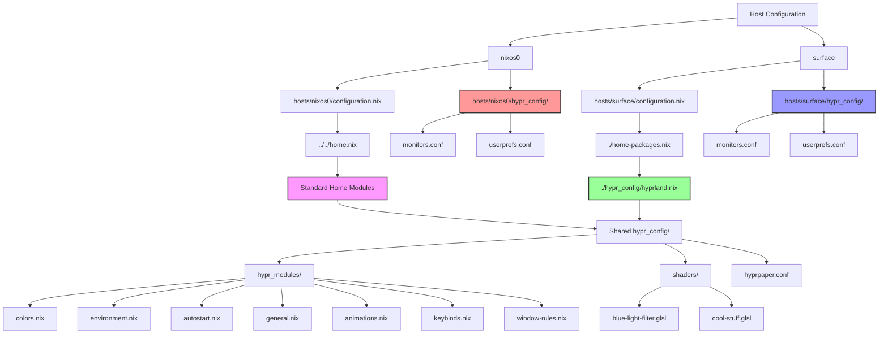

# Host to Hypr-Config Mapping

## Overview
This document maps the relationships between NixOS hosts and their Hyprland window manager configurations in this multi-host setup.

## Architecture Summary

The configuration follows a hierarchical structure where:
- **Shared configurations** are stored in `/hypr_config/` and `/hypr_config/hypr_modules/`
- **Host-specific configurations** are stored in `/hosts/<hostname>/hypr_config/`
- Each host imports shared modules but uses host-specific override files

## Host Mapping

### 1. nixos0 (Desktop/Build Machine)
**Hostname:** `popcat19-nixos0`

#### Configuration Flow:
```
hosts/nixos0/configuration.nix
    ↓ (imports)
../../home.nix
    ↓ (imports)
[Standard home modules - NO hyprland]
```

**Key Finding:** nixos0 does **NOT** have Hyprland configured in its main home.nix import chain.

#### Available Hyprland Files:
- `hosts/nixos0/hypr_config/hyprland.nix` - Complete Hyprland module
- `hosts/nixos0/hypr_config/monitors.conf` - nixos0-specific monitor config
- `hosts/nixos0/hypr_config/userprefs.conf` - nixos0-specific user preferences

#### Hyprland Module Structure (nixos0):
```nix
# hosts/nixos0/hypr_config/hyprland.nix
imports = [
  # Shared modules from main config
  ../../../hypr_config/hypr_modules/colors.nix
  ../../../hypr_config/hypr_modules/environment.nix
  ../../../hypr_config/hypr_modules/autostart.nix
  ../../../hypr_config/hypr_modules/general.nix
  ../../../hypr_config/hypr_modules/animations.nix
  ../../../hypr_config/hypr_modules/keybinds.nix
  ../../../hypr_config/hypr_modules/window-rules.nix
];

# Host-specific file deployment
home.file = {
  ".config/hypr/monitors.conf".source = ./monitors.conf;
  ".config/hypr/userprefs.conf".source = ./userprefs.conf;
  ".config/hypr/hyprpaper.conf".source = ../../../hypr_config/hyprpaper.conf;
  ".config/hypr/shaders" = { source = ../../../hypr_config/shaders; recursive = true; };
};
```

### 2. surface (Laptop/Device)
**Hostname:** `popcat19-surface0`

#### Configuration Flow:
```
hosts/surface/configuration.nix
    ↓ (imports)
./home-packages.nix
    ↓ (imports)
./hypr_config/hyprland.nix  ← ACTIVELY IMPORTED
    ↓ (imports)
[Shared hypr_modules + host-specific files]
```

**Key Finding:** surface **DOES** have Hyprland configured and actively imported.

#### Available Hyprland Files:
- `hosts/surface/hypr_config/hyprland.nix` - Complete Hyprland module
- `hosts/surface/hypr_config/monitors.conf` - Surface-specific monitor config
- `hosts/surface/hypr_config/userprefs.conf` - Surface-specific user preferences

#### Hyprland Module Structure (surface):
```nix
# hosts/surface/hypr_config/hyprland.nix
imports = [
  # Shared modules from main config
  ../../../hypr_config/hypr_modules/colors.nix
  ../../../hypr_config/hypr_modules/environment.nix
  ../../../hypr_config/hypr_modules/autostart.nix
  ../../../hypr_config/hypr_modules/general.nix
  ../../../hypr_config/hypr_modules/animations.nix
  ../../../hypr_config/hypr_modules/keybinds.nix
  ../../../hypr_config/hypr_modules/window-rules.nix
];

# Host-specific file deployment
home.file = {
  ".config/hypr/monitors.conf".source = ./monitors.conf;
  ".config/hypr/userprefs.conf".source = ./userprefs.conf;
  ".config/hypr/hyprpaper.conf".source = ../../../hypr_config/hyprpaper.conf;
  ".config/hypr/shaders" = { source = ../../../hypr_config/shaders; recursive = true; };
};
```

## Shared Configuration Structure

### Base Hyprland Configuration Files:
- `hypr_config/hyprland.conf` - Base Hyprland config
- `hypr_config/hyprland.nix` - Base NixOS Hyprland module
- `hypr_config/hyprpanel.nix` - Hyprpanel configuration
- `hypr_config/hyprpaper.conf` - Wallpaper configuration
- `hypr_config/monitors.conf` - Default monitor configuration
- `hypr_config/userprefs.conf` - Default user preferences

### Shared Modules (`hypr_config/hypr_modules/`):
- `animations.nix` - Animation settings
- `autostart.nix` - Autostart applications
- `colors.nix` - Color scheme configuration
- `environment.nix` - Environment variables
- `general.nix` - General Hyprland settings
- `keybinds.nix` - Keyboard shortcuts
- `window-rules.nix` - Window management rules

### Shared Resources:
- `hypr_config/shaders/` - GLSL shaders for effects
  - `blue-light-filter.glsl`
  - `cool-stuff.glsl`

## Visual Representation



## Key Differences Between Hosts

| Aspect | nixos0 | surface |
|--------|--------|---------|
| **Hyprland Enabled** | ❌ Not imported | ✅ Actively imported |
| **Home Config** | Uses `../../home.nix` | Uses `./home-packages.nix` |
| **Monitor Config** | `hosts/nixos0/hypr_config/monitors.conf` | `hosts/surface/hypr_config/monitors.conf` |
| **User Preferences** | `hosts/nixos0/hypr_config/userprefs.conf` | `hosts/surface/hypr_config/userprefs.conf` |
| **Usage Context** | Desktop/Build machine | Laptop/Mobile device |

## Configuration Inheritance Pattern

Both hosts follow the same pattern when Hyprland is enabled:

1. **Import shared modules** from `hypr_config/hypr_modules/`
2. **Deploy host-specific files** to `~/.config/hypr/`
3. **Deploy shared resources** (shaders, hyprpaper.conf)
4. **Use host-specific** `monitors.conf` and `userprefs.conf`

## File Deployment Locations

When Hyprland is enabled, files are deployed to:

```
~/.config/hypr/
├── monitors.conf          # Host-specific
├── userprefs.conf         # Host-specific
├── hyprpaper.conf         # Shared
└── shaders/               # Shared
    ├── blue-light-filter.glsl
    └── cool-stuff.glsl
```

## Summary

- **nixos0**: Has Hyprland configuration files available but **not actively imported** in the current setup
- **surface**: Has Hyprland configuration files and **actively imports** them
- Both hosts use identical shared module structure
- Host-specific differences are isolated to `monitors.conf` and `userprefs.conf`
- The architecture allows for easy enabling/disabling of Hyprland per host