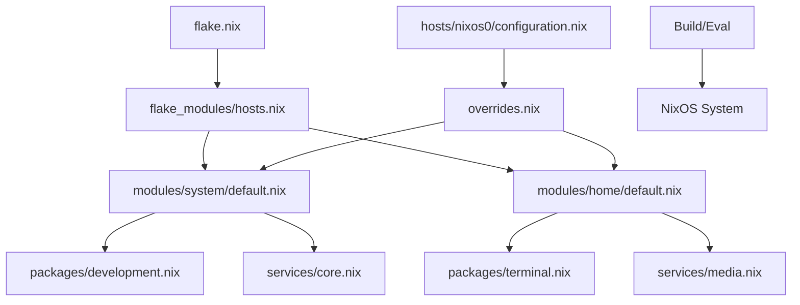

# Proposed Better Package and Service Management Structure

## Current Structure Analysis Summary
The existing configuration uses a flake-based setup with aggregated modules for system and home management. Packages are categorized in `packages/system/` and `packages/home/` directories, aggregated via `default.nix` files that concatenate lists from sub-modules (e.g., `development.nix`, `gui.nix`). Services are primarily defined in `system_modules/services.nix` and `home_modules/services.nix`, but imported via `default.nix` aggregators that pull in many specific modules (e.g., `audio.nix`, `virtualisation.nix`).

Key elements:
- **Flake Integration**: `flake.nix` dynamically generates host configs using `flake_modules/hosts.nix` and imports aggregated modules.
- **Aggregation Pattern**: Uses `builtins.concatLists` for packages, with early/late distinction in home packages.
- **Host-Specific Overrides**: Minimal; most shared via modules, with some per-host additions in `configuration.nix`.

## Identified Pain Points and Improvement Opportunities
1. **Scattered Definitions**: Packages and services are split across many small files without a unified entry point. Adding a new package requires knowing the right category file, leading to maintenance overhead.
   - **Opportunity**: Introduce a centralized registry or options-based enabling (e.g., `environment.packages.development.enable = true;`) to declaratively include categories.

2. **Flat Aggregation**: Concatenation in `default.nix` works but doesn't enforce dependencies or provide introspection. No clear ordering for system packages (unlike home's early/late).
   - **Opportunity**: Use NixOS module options with types (e.g., `lib.types.attrsOf (lib.types.listOf lib.types.package)`) for categorized packages/services, allowing overrides and better merging.

3. **Lack of Modularity for Services**: Services are enabled statically in modules without fine-grained control. Host-specific services (e.g., in `surface0/system_modules/`) duplicate patterns.
   - **Opportunity**: Standardize service modules with sub-options (e.g., `services.networking.vpn.enable = true;`) and use conditionals based on host/hardware.

4. **Overlays and Custom Packages**: Overlays are loaded globally in `flake_modules/overlays.nix`, but custom packages aren't clearly separated.
   - **Opportunity**: Move custom packages to a dedicated `packages/custom/` with overlays only for modifications, following Nixpkgs patterns.

5. **Scalability and Discoverability**: As hosts grow (e.g., `nixos0`, `surface0`, `thinkpad0`), shared vs. per-host becomes blurry. No documentation or auto-generated overviews.
   - **Opportunity**: Restructure to `modules/shared/`, `modules/system/`, `modules/home/`, with host dirs only for overrides. Add a `lib/` for shared helpers and generate a module browser via `nix flake check`.

6. **Dependency Management**: No explicit handling for package/service inter-deps beyond Nix's evaluation.
   - **Opportunity**: Leverage `mkIf` and `mkDefault` more, plus `environment.systemPackages` ordering via module priorities.

7. **Theming and External Inputs**: Inputs like `rose-pine` are overlaid but not modularized for easy theming toggles.
   - **Opportunity**: Create a `themes/` module with options to select/enable themes, integrating overlays dynamically.

## Proposed Restructured Directory Layout
```
nixos-config/
├── flake.nix                          # Unchanged: Core flake outputs
├── flake_modules/                     # Host/module generators
│   ├── hosts.nix                      # Enhanced with more args for modularity
│   ├── modules.nix                    # Add package/service aggregators as modules
│   └── overlays.nix                   # Only system-wide overlays; move custom pkgs out
├── modules/                           # New: Centralized modules (replaces system_modules/home_modules)
│   ├── lib/                           # Shared utilities (e.g., package lists, validators)
│   │   ├── default.nix
│   │   ├── packages.nix               # Helper for categorized pkgs
│   │   └── services.nix               # Helper for service options
│   ├── shared/                        # Cross-system (e.g., fonts, privacy)
│   │   ├── default.nix                # Aggregator
│   │   ├── fonts.nix
│   │   └── privacy.nix
│   ├── system/                        # System-level (replaces system_modules/)
│   │   ├── default.nix                # Imports categories
│   │   ├── packages/                  # Categorized pkgs (replaces packages/system/)
│   │   │   ├── default.nix            # Options: { development = mkOption { type = types.listOf types.package; }; }
│   │   │   ├── development.nix
│   │   │   ├── gui.nix
│   │   │   └── networking.nix
│   │   └── services/                  # Categorized services
│   │       ├── default.nix
│   │       ├── core.nix               # Boot, hardware, users
│   │       ├── desktop.nix            # Display, audio
│   │       └── networking.nix         # VPN, SSH
│   └── home/                          # User-level (replaces home_modules/)
│       ├── default.nix                # Imports categories
│       ├── packages/                  # Categorized pkgs (replaces packages/home/)
│       │   ├── default.nix            # early/late attrs
│       │   ├── development.nix
│       │   └── terminal.nix
│       └── services/                  # User services
│           ├── default.nix
│           ├── media.nix              # playerctld, easyeffects
│           └── clipboard.nix          # cliphist
├── packages/                          # Custom packages (non-overlay)
│   ├── custom/                        # Build derivations here
│   │   └── default.nix
│   └── overlays/                      # Per-package overlays (replaces current overlays/)
│       └── rose-pine.nix              # Theme-specific
├── hosts/                             # Host-specific overrides only
│   ├── nixos0/
│   │   ├── configuration.nix          # Imports modules/system/default.nix + overrides
│   │   └── overrides.nix              # New: { services.custom.enable = true; }
│   └── surface0/
│       ├── configuration.nix
│       └── overrides.nix              # Hardware-specific (e.g., thermal)
└── themes/                            # Optional: Theme modules
    ├── default.nix
    └── rose-pine.nix
```

## Key Changes in Proposal
- **Modular Options**: Instead of flat lists, use NixOS options like:
  ```nix
  # In modules/system/packages/default.nix
  { lib, ... }: {
    options.environment.packages = {
      development = lib.mkOption {
        type = lib.types.listOf lib.types.package;
        default = [];
        description = "Development tools";
      };
    };
    config.environment.systemPackages = lib.mkMerge [
      (lib.mkIf config.environment.packages.development.enable (with pkgs; [ gh ripgrep ]))
      # ...
    ];
  }
  ```
  Enable via `environment.packages.development.enable = true;` in host configs.

- **Service Submodules**: For services, use nested options:
  ```nix
  # In modules/system/services/networking.nix
  { ... }: {
    options.services.networking.vpn = {
      enable = lib.mkEnableOption "VPN services";
      package = lib.mkOption { type = lib.types.package; };
    };
    config = lib.mkIf config.services.networking.vpn.enable {
      services.openvpn.enable = true;
      # ...
    };
  }
  ```

- **Migration Strategy**:
  - Move files from `system_modules/` to `modules/system/`, updating imports in `default.nix`.
  - Convert package lists to option-based in new `packages/` subdirs.
  - For hosts, add `overrides.nix` importing base modules + custom.
  - Update `flake.nix` to import from `modules/` instead of old paths.
  - Test with `nixos-rebuild dry-run --flake .#<hostname>`.

- **Benefits**:
  - **Discoverability**: Clear categories, options for `man configuration.nix`-like browsing.
  - **Reusability**: Shared modules with host overrides reduce duplication.
  - **Scalability**: Easy to add categories/submodules without touching aggregators.
  - **Best Practices Alignment**: Follows NixOS manual patterns for modules, options, and declarative enabling.

## Mermaid Diagram: Proposed Module Flow


This structure promotes modularity per NixOS docs, reducing boilerplate while maintaining flake reproducibility.
